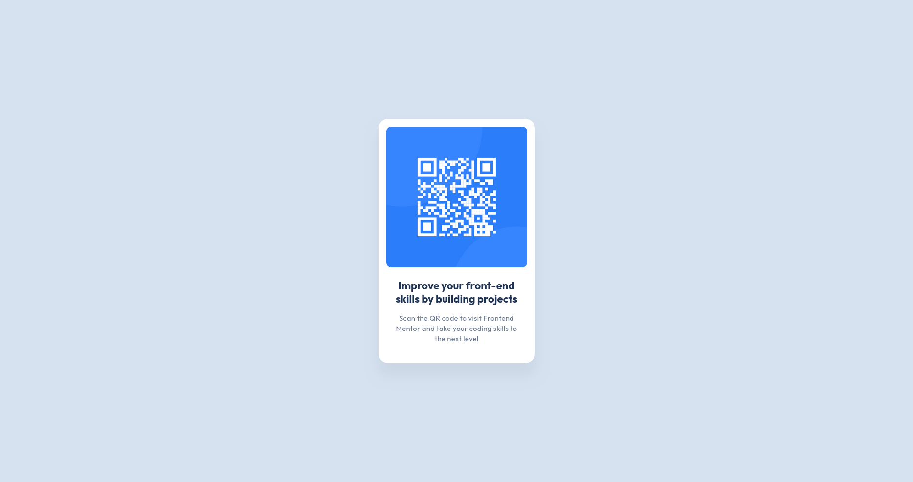

# Frontend Mentor Completed Challenges

## QR Code Component (26/5/2025)

- [Live Demo](https://mihaelshneyderis.github.io/frontend-mentor-challenges/qr-code-component/code/)
- [Source Code](https://github.com/mihaelshneyderis/frontend-mentor-challenges/tree/main/qr-code-component)
- [Challenge](https://www.frontendmentor.io/challenges/qr-code-component-iux_sIO_H)

### What I learned
- The element that contains everything should be main instead of div.
- CSS variable naming conventions.
- Using min(desired value, 100%) to make it responsive on mobile.
- Use CSS reset to not have to do it manually.
- Set main to min 100vh so that content can be centered on page.
- Remember to use meta tags for SEO
### Continued development
- I want to get faster, I spent too much time overthinking minor code details that don't affect the design
- I want to get better at the basics
- I want to learn more about best practices

[//]: # (
---
## Challenge Name (Date)

- [Live Demo](https://mihaelshneyderis.github.io/frontend-mentor-challenges/challenge-folder/code/)
- [Source Code](https://github.com/mihaelshneyderis/frontend-mentor-challenges/tree/main/challenge-folder)
### What I learned
-
### Continued development
-
)
